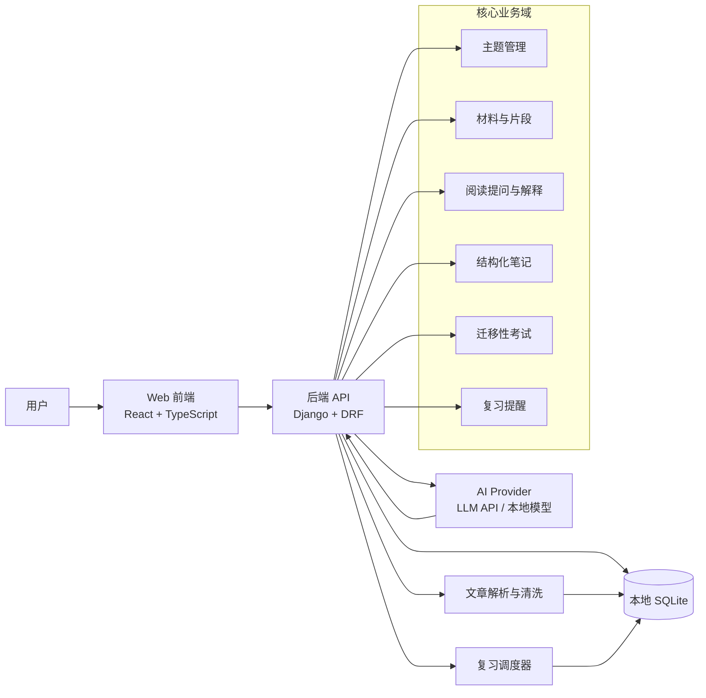
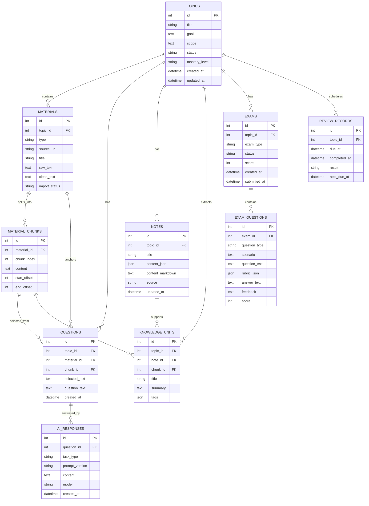

# AI 辅助学习系统 MVP 技术方案

**方案结论：**MVP 建议采用本地单体 Web 应用：前端使用 React + TypeScript + Vite，后端使用 Python Django，SQLite 作为本地持久化存储，AI 接入通过可插拔 LLM Provider 封装。该形态最适合个人本地部署，能以较低工程复杂度覆盖“主题创建 → 文章导入 → 阅读提问 → 结构化笔记 → 迁移性考试 → 复习提醒”的最小闭环，并为后续扩展多材料、知识召回和多模态内容预留边界。

## 背景与目标

产品定位来自《AI 辅助学习系统产品文档》：系统面向个人学习场景，不替人学习，而是增强找知识、熟悉、理解、查资料、抽象、内化、应用和复习等环节。产品判断学习是否完成的标准不是“是否看过总结”，而是用户能否在其他场合迁移运用知识；因此 MVP 必须保留考试与复习能力。

本技术方案基于产品设计文档和 MVP 原型线框图编写。产品设计文档为 [AI 辅助学习系统产品文档](https://bytedance.larkoffice.com/docx/OlYkdtMtLowsdFxBES5clTmanxh)；MVP 原型线框图为 [https://dd8dcdcb23a7.aime-app.bytedance.net](https://dd8dcdcb23a7.aime-app.bytedance.net)。原型链接作为后续页面结构、交互细节和验收走查的主要依据。

MVP 的工程目标是先验证完整学习闭环是否成立，而不是一次性做成通用学习平台。系统应支持个人本地部署、单用户使用、文字材料优先、数据本地保存、AI 能力可替换，并允许后续演进到多材料主题、跨主题召回、完整间隔复习和多模态内容处理。

**非目标。** MVP 不实现团队协作、账号体系、公开社区、复杂权限、多端同步、向量数据库、完整 spaced repetition 算法、多模态解析和跨主题混合考试。这些能力应通过清晰模块边界预留扩展点，但不进入第一版交付范围。

## 技术选型

技术选型以“生态丰富、功能齐全、开发简单、出错概率低”为主要目标。由于这个系统只作为本地站点使用，不需要公网访问、复杂性能优化、多用户鉴权或云端运维，MVP 应优先选择能减少自研代码量的成熟全栈组合。整体原则是：框架默认能力能覆盖的事情不自建，成熟组件能解决的事情不手写，业务代码集中在学习闭环本身。

| 层次 | 推荐选型 | 选择理由 | MVP 边界 |
| --- | --- | --- | --- |
| 前端 | React + TypeScript + Vite + Ant Design | React 生态丰富，Vite 启动和构建简单，Ant Design 提供列表、表单、抽屉、Tabs、空状态、通知、步骤条等现成组件，可明显减少页面开发量。 | 不做 SSR，不做复杂前端架构；页面状态优先用 TanStack Query + React Hook Form + 少量本地状态。 |
| 后端 | Python + Django + Django REST Framework | Django 自带 ORM、迁移、Admin、配置管理、表单校验和管理后台；DRF 能快速提供 REST API。相比轻量框架，Django 的“电池齐全”更符合开发简单、少踩坑的目标。 | 单体应用；不拆微服务；AI 耗时任务先用数据库任务状态 + 同步/短轮询兜底，暂不引入 Celery 和消息队列。 |
| 存储 | SQLite + Django ORM + Django Migration | SQLite 本地零运维，Django ORM 和 migration 能覆盖主题、材料、片段、问题、解释、笔记、考试和复习记录等关系型数据，减少手写 SQL 和迁移脚本。 | 全文检索可先用 SQLite FTS5 或普通 LIKE 兜底；不引入 Postgres、Redis、向量库。 |
| AI 接入 | Provider 封装 + Pydantic/JSON Schema 校验 + Prompt 模板 | AI 调用集中封装，业务模块只依赖任务类型和结构化结果；输出用 schema 校验，能降低模型返回不稳定导致的运行错误。 | MVP 只接一个默认 provider；保留 provider 接口，后续再扩展本地模型或其他云模型。 |
| 页面/编辑能力 | Ant Design + Markdown 编辑器 | 用成熟 UI 组件和 Markdown 编辑器覆盖结构化笔记、考试作答、反馈展示，避免自研富文本编辑器。 | 不做块编辑、拖拽编排和复杂富文本；需要时后续再替换编辑器。 |
| 部署 | 本地 Python 虚拟环境或 Docker Compose | 本地站点优先保证启动简单。开发期可用虚拟环境直接运行；需要稳定复现环境时再用 Docker Compose。 | 仅监听 localhost；不设计公网访问、登录鉴权、HTTPS、多用户隔离和云端备份。 |

后端可以并且建议选择 Python + Django。这里的核心理由不是性能，而是降低开发量和出错概率：Django 把数据模型、迁移、后台管理、配置、校验和常规 Web 工程结构都标准化了，AI 在这个框架内生成代码时更容易沿着稳定约定工作。轻量 API 框架更轻、更灵活，但本项目不是高性能 API 服务，早期更需要“功能齐全、默认路径清楚、少造轮子”。

### 异步 LLM 交互设计

与 LLM 交互的地方默认不设计成长时间同步阻塞接口。MVP 中的阅读前导、选中提问、笔记草稿、考试生成、考试评分等能力都可能受到模型延迟、网络波动和输出重试影响，因此后端应把“发起任务”和“获取结果”拆开：前端提交请求后，后端创建 AI 任务记录并返回 `task_id`；任务执行完成后，前端通过轮询 `GET /ai-tasks/{task_id}` 或 SSE 订阅获取状态与结果。只有预计耗时很短、且失败可快速返回的轻量能力，才允许在同一个请求内直接返回结果。

Django 侧推荐使用 Django 3.1+ 支持的 async view 承接异步 I/O；如果任务会持续较久，或需要重试、恢复、定时触发，则使用 Celery、APScheduler 或简化版数据库任务表承载后台执行。MVP 可以先用数据库任务状态加轻量后台 worker 或 management command 实现，不必一开始引入完整消息队列；但接口契约应先按异步任务设计，避免后续从同步 API 迁移时影响前端。

Ollama 或其他 HTTP 型 LLM Provider 推荐使用 `httpx.AsyncClient` 调用，并统一配置 timeout、重试、取消和错误归一化。支持 streaming 的模型调用应优先采用流式输出：阅读提问、解释生成、笔记草稿这类需要用户等待的场景，可以通过 SSE 把增量 token 或阶段状态推给前端；考试生成、评分等需要结构化校验的任务，可以先流式展示生成中、校验中、已完成等状态，最终结果仍以通过 schema 校验后的完整对象入库。

API 响应建议采用统一任务模型：`pending` 表示已创建未执行，`running` 表示调用中，`succeeded` 表示结果可用，`failed` 表示失败且包含可展示错误，`cancelled` 表示用户取消。任务结果中保存 `task_type`、模型名称、prompt 版本、输入摘要、输出内容、耗时、错误信息和重试次数，方便定位模型质量和运行问题。

| 场景 | 发起接口 | 查询/订阅接口 | 说明 |
| --- | --- | --- | --- |
| 阅读前导 | `POST /materials/{id}/briefing-tasks` | `GET /ai-tasks/{task_id}` 或 SSE | 可流式展示生成进度。 |
| 选中提问 | `POST /questions` | `GET /ai-tasks/{task_id}` 或 SSE | 问题先入库，回答完成后关联 `ai_responses`。 |
| 笔记草稿 | `POST /topics/{id}/note-draft-tasks` | `GET /ai-tasks/{task_id}` | 草稿必须由用户确认后才进入正式笔记。 |
| 考试生成 | `POST /topics/{id}/exam-tasks` | `GET /ai-tasks/{task_id}` | 生成完成后创建 exam 和 exam_questions。 |
| 考试评分 | `POST /exams/{id}/grading-tasks` | `GET /ai-tasks/{task_id}` | 评分完成后更新题目反馈、考试分数和掌握状态。 |

### 三方库复用建议与自研边界

上一轮三方库分析的结论是：MVP 不应该从 0 自研通用能力，真正需要自研的是学习闭环编排、学习对象模型、AI 编排 Prompt 与结果校验、掌握状态判断。其余能力优先复用成熟库或成熟产品，降低开发量和出错概率。

| 功能 | 推荐复用方案 | 自研边界 |
| --- | --- | --- |
| 主题、材料、笔记、考试 CRUD | Django ORM + DRF ModelViewSet / Serializer | 只写业务字段、状态流转、权限假设和少量接口编排，不手写通用 CRUD 框架。 |
| 管理后台 | Django Admin | MVP 直接用于查看、修正本地数据，不单独开发后台页面。 |
| 前端基础组件 | Ant Design | 列表、表单、详情、弹窗、抽屉、通知、步骤条全部复用组件库，只做页面组合和业务交互。 |
| 前端请求与缓存 | TanStack Query | 不手写全局 loading、cache、retry 和请求状态体系。 |
| 前端表单 | Ant Design Form / React Hook Form | 简单表单用 AntD Form；复杂校验再引入 React Hook Form。 |
| Markdown 笔记编辑 | MDXEditor / Milkdown / EasyMDE + react-markdown | 先支持标题、列表、引用、代码块和简单表格；不做 Notion 式块编辑器。 |
| 网页正文抽取 | trafilatura / readability-lxml / newspaper3k | 只做 URL 导入、正文清洗、来源保存；抓取失败允许用户粘贴正文兜底。 |
| 文本切分 | LangChain text splitters / LlamaIndex node parser / 轻量 splitter | MVP 可先按标题、段落和长度切分，不做复杂语义切分。 |
| AI 结构化输出校验 | Pydantic / JSON Schema | AI 输出必须通过 schema 校验再落库，失败时保留错误并允许重试。 |
| API 文档 | drf-spectacular / drf-yasg | 自动生成 OpenAPI，不手写接口文档。 |
| 本地配置 | django-environ / python-dotenv | 集中管理 LLM Key、本地数据库路径和调试配置。 |
| 复习检查 | Django management command + cron / APScheduler | 先不用 Celery、Redis 或复杂任务队列；本地定时检查足够。 |
| 测试 | pytest + pytest-django + factory_boy | 重点覆盖状态流、AI 输出解析、考试评分落库和复习规则。 |

不建议在 MVP 自研富文本/块编辑器、完整 spaced repetition 算法、浏览器插件、向量知识库和复杂后台任务系统。复习算法可以先用简单规则，例如考试未通过 1 天后复习、通过但低分 3 天后复习、高分 7 天后复习；向量检索和 FSRS/SM-2 这类能力放到 V1 或之后再评估。

## 方案总览

系统采用“前端单页应用 + 后端 API + 本地 SQLite + AI Provider”的单体分层架构。前端只负责页面状态、用户输入和结果展示；后端负责业务规则、数据持久化、文章解析、AI 调用编排和考试/复习状态更新；SQLite 作为唯一事实源保存学习闭环的所有对象。AI 不直接写库，而是通过后端服务生成解释、笔记草稿、考题和评分建议，再由业务模块校验后落库。

> [飞书画板：mermaid A9BCwcRj0hC4tfb2limckqoNnqb]



这张架构图表达的是 MVP 的运行边界：浏览器与后端通过 HTTP API 通信；后端集中管理数据与 AI 编排；所有长期状态都落在 SQLite；文章解析、AI Provider 和复习调度器是可替换的内部组件。后续如果要扩展向量检索或后台任务队列，可以在后端内部替换实现，不需要改变前端主要交互契约。

## 核心模块拆分

模块拆分按产品文档中的五层学习能力映射到工程模块。MVP 不把每个产品能力都做成独立服务，而是在后端单体内按领域目录隔离，保证开发速度和边界清晰。

| 产品层 | 工程模块 | 职责 | 关键接口 |
| --- | --- | --- | --- |
| L1 学习主题管理 | Topic Service | 创建主题，维护目标、范围、状态、进度、学习深度和掌握状态摘要。 | `POST /topics`<br>`GET /topics`<br>`GET /topics/{id}` |
| L2 材料处理 | Material Service | 支持 URL/文本导入，清洗正文，保存来源，切分片段，为阅读和追问提供引用锚点。 | `POST /topics/{id}/materials`<br>`GET /materials/{id}` |
| L3 理解增强 | Learning Assistant | 生成阅读前导、解释选中文本、回答用户问题，并把 AI 解释与材料片段关联。 | `POST /materials/{id}/briefing`<br>`POST /questions` |
| L4 知识构建 | Note Service | 维护结构化笔记，支持 AI 生成草稿、用户编辑确认，并从笔记中抽取内部知识单元。 | `POST /topics/{id}/notes`<br>`PUT /notes/{id}` |
| L5 掌握验证 | Exam Service | 基于主题材料和笔记生成迁移性考题，保存作答，调用 AI 评分并更新掌握状态。 | `POST /topics/{id}/exams`<br>`POST /exams/{id}/submit` |
| L5 复习巩固 | Review Service | 根据考试结果和复习记录计算下次复习时间，提供提醒列表和复习题。 | `GET /reviews/due`<br>`POST /reviews/{id}/complete` |
| 基础能力 | AI Gateway | 封装模型调用、Prompt 模板、结构化输出解析、重试、超时和错误归一化。 | 内部接口，不直接暴露给前端。 |

前端页面按用户任务拆分为主题列表页、主题详情页、学习阅读页、笔记页、考试页和复习页。阅读页是 MVP 的交互核心，需要同时展示文章正文、选中文本、AI 问答面板和笔记入口；考试页是闭环验证核心，需要避免变成原文记忆题展示器，而应突出迁移场景、作答、反馈和掌握状态更新。

## 数据模型

数据模型遵循产品文档的知识对象模型，并在 MVP 中做工程化收敛。主题是聚合根，材料、片段、问题、解释、笔记、考试和复习记录都围绕主题组织。知识单元是系统内部对象，用来连接材料、笔记和后续出题，不直接暴露给用户。

> [飞书画板：mermaid JxJawqEPmhPzlfbCszZcZqXAnmf]



ER 图中的主链路是：一个学习主题拥有多份材料，每份材料切分为多个片段；用户基于材料或片段提问，AI 生成回答；用户把理解沉淀为笔记，系统从笔记和片段中抽取知识单元；考试基于主题生成题目与评分；复习记录根据考试和复习结果安排下一次复习。

### 字段解释

| 字段 | 所属对象 | 解释 |
| --- | --- | --- |
| `status` | `topics` | 主题当前所处阶段，例如 `draft`、`learning`、`exam_ready`、`reviewing`、`archived`。它描述“流程走到哪了”，不等同于掌握程度。 |
| `mastery_level` | `topics` | 用户对主题的掌握程度，例如 `unknown`、`weak`、`pass`、`strong`。它主要由考试分数、评分反馈和复习结果更新。 |
| `raw_text` | `materials` | 原始导入文本，尽量保留抓取或粘贴时的内容，便于后续排查正文清洗问题。 |
| `clean_text` | `materials` | 清洗后的正文，用于阅读展示、切分、AI 摘要和出题。通常会去掉导航、广告、重复空白等噪声。 |
| `import_status` | `materials` | 材料导入状态，例如 `pending`、`success`、`failed`。URL 抓取失败时可提示用户改用文本粘贴。 |
| `chunk_index` | `material_chunks` | 片段在材料中的顺序号，用于恢复阅读顺序，也用于定位选区和引用来源。 |
| `start_offset` / `end_offset` | `material_chunks` | 片段在 `clean_text` 中的起止位置。它们让系统能把 AI 回答、选中文本和原文位置关联起来。 |
| `selected_text` | `questions` | 用户提问时选中的原文片段。即使片段切分规则后续变化，也能保留当时的提问上下文。 |
| `task_type` | `ai_responses` | AI 调用任务类型，例如 `briefing`、`answer_question`、`draft_note`、`generate_exam`、`grade_exam`。它用于区分同一张表里的不同 AI 输出。 |
| `prompt_version` | `ai_responses` | 生成该结果时使用的 Prompt 版本。后续如果评分或笔记质量变差，可以定位是哪一版 Prompt 产生的问题。 |
| `content_json` | `notes` | 结构化笔记内容，适合页面渲染和后续抽取知识单元。MVP 可先保存简单 JSON，不追求复杂块编辑模型。 |
| `content_markdown` | `notes` | Markdown 形式的笔记文本，适合用户编辑、复制和导出。它和 `content_json` 可以同时保存。 |
| `source` | `notes` | 笔记来源，例如 `user`、`ai_draft`、`mixed`。用于区分用户自己写的内容和 AI 草稿。 |
| `knowledge_units` | 内部对象 | 系统内部知识点，不直接展示给用户。它把材料片段、笔记和考试题目连接起来，后续可用于召回、出题和复习。 |
| `scenario` | `exam_questions` | 迁移性考试的场景描述。题目不应只复述原文，而应把知识放到新情境中检验用户能否应用。 |
| `rubric_json` | `exam_questions` | 评分标准，说明这道题如何判分、哪些要点算正确、哪些错误需要反馈。AI 评分必须基于它输出。 |
| `due_at` / `next_due_at` | `review_records` | `due_at` 是本次应复习时间，`next_due_at` 是完成本次复习后计算出的下一次复习时间。 |

SQLite schema 应通过 Django Migration 管理。为了降低早期复杂度，MVP 不需要一开始引入复杂索引或向量检索，但需要为 `topic_id`、`material_id`、`exam_id`、`due_at` 建立基础索引，保证主题详情、阅读页、考试页和复习提醒列表在本地数据增长后仍能快速加载。

## 关键数据流

关键数据流围绕学习闭环展开。MVP 中每条数据流都应明确用户动作、后端处理、AI 参与点和落库结果，避免 AI 输出游离在系统状态之外。

| 数据流 | 步骤 | 落库对象 |
| --- | --- | --- |
| 主题创建 | 用户输入主题名称、学习目标和范围；后端创建主题，并初始化学习状态为 `draft` 或 `learning`。 | `topics` |
| 文章导入 | 用户提交 URL 或文本；后端抓取/接收正文，清洗后保存材料，并按段落或 token 长度切分片段。 | `materials`<br>`material_chunks` |
| 快速熟悉 | 用户进入阅读页；后端将材料摘要、标题和片段发送给 AI，生成阅读前导、关键词和难点提示。 | `ai_responses` |
| 选中提问 | 用户选中文本并输入问题；后端关联材料片段，调用 AI 生成解释，返回给前端并保存问答记录。 | `questions`<br>`ai_responses` |
| 结构化笔记 | 用户基于阅读和问答创建笔记；AI 可生成草稿，但用户编辑确认后才作为正式笔记保存，并可抽取知识单元。 | `notes`<br>`knowledge_units` |
| 迁移性考试 | 用户发起考试；后端基于材料、笔记和知识单元生成场景化题目；用户作答后 AI 按 rubric 评分并输出反馈。 | `exams`<br>`exam_questions` |
| 复习提醒 | 考试或复习完成后，后端根据成绩和结果计算下次复习时间；前端展示到期提醒。 | `review_records`<br>`topics.mastery_level` |

考试评分是 MVP 的关键质量点。AI 评分不能只返回“对/错”，而应返回得分、理由、薄弱点和建议复习内容。后端需要保存评分依据中的 rubric，并把结果映射为掌握状态更新。若 AI 返回结构不符合 schema，后端应把考试提交标记为 `grading_failed`，允许用户重试评分，而不是丢失作答。

## AI 接入设计

AI 接入通过统一网关完成，核心目标是让业务模块只关心“任务类型”和“上下文”，不直接依赖具体模型 API。网关层提供 `generate_briefing`、`answer_question`、`draft_note`、`generate_exam`、`grade_exam` 和 `schedule_review_hint` 等能力，每个能力对应独立 prompt 模板和输出 schema。

```python
class AIGateway:
    async def generate_briefing(self, material: Material) -> BriefingResult: ...
    async def answer_question(self, question: QuestionContext) -> AnswerResult: ...
    async def draft_note(self, topic: TopicContext) -> NoteDraft: ...
    async def generate_exam(self, topic: TopicContext) -> ExamDraft: ...
    async def grade_exam(self, submission: ExamSubmission) -> GradeResult: ...
```

每次 AI 调用都应记录模型名称、任务类型、prompt 版本、输入摘要、输出内容、耗时和错误信息。MVP 不需要做复杂观测平台，但需要在本地日志和数据库中留下可诊断线索，否则 AI 生成质量问题难以复盘。

## 部署方式

MVP 按“本地个人站点”处理：系统只在电脑拥有者自己的机器上使用，默认通过 `localhost` 访问。技术方案不考虑公网访问、登录鉴权、HTTPS、多用户隔离、云端备份和大规模性能优化；这些都不是当前产品假设的一部分。

开发期推荐使用本地 Python 虚拟环境运行 Django 后端，前端用 Vite dev server 运行。这样启动链路最短，调试最直接。需要把环境固定下来时，再提供 Docker Compose，把前端、后端和 `./data/app.db` 挂载到同一个项目目录下。

```bash
# backend
cd backend
python -m venv .venv
source .venv/bin/activate
pip install -r requirements.txt
python manage.py migrate
python manage.py runserver 127.0.0.1:8000

# frontend
cd frontend
npm install
npm run dev
```

```yaml
services:
  backend:
    build: ./backend
    env_file: .env
    volumes:
      - ./data:/app/data
    ports:
      - "127.0.0.1:8000:8000"
  frontend:
    build: ./frontend
    environment:
      - VITE_API_BASE_URL=http://127.0.0.1:8000
    ports:
      - "127.0.0.1:5173:80"
```

本地部署的验收标准是启动简单、错误清楚、数据不丢。项目应提供 `.env.example`、初始化命令说明和健康检查接口；SQLite 文件固定放在 `./data` 目录，重启服务后学习记录仍能保留。

## MVP 实现路径

MVP 应按闭环可用性拆阶段，而不是按技术层横向铺开。每个阶段都应交付一条可演示路径，避免先写大量底层代码却无法验证学习体验。

| 阶段 | 交付内容 | 验收标准 | 主要风险 |
| --- | --- | --- | --- |
| 阶段 1 | 项目骨架、SQLite schema、主题管理、文章文本导入、基础页面路由。 | 能创建主题，导入一篇纯文本文章，并在主题详情中查看。 | 数据模型过早复杂化；应先保证主链路跑通。 |
| 阶段 2 | URL 导入、正文清洗、材料片段切分、阅读页和选中文本提问。 | 能导入网页文章，在阅读页选中段落向 AI 提问并保存问答。 | 网页抓取质量不稳定；MVP 允许用户改用文本导入兜底。 |
| 阶段 3 | 阅读前导、结构化笔记草稿、用户编辑保存、知识单元轻量抽取。 | 用户能完成“阅读 → 提问 → 形成自己的结构化笔记”。 | AI 草稿可能替代用户思考；界面上应区分 AI 草稿和用户确认内容。 |
| 阶段 4 | 迁移性考试生成、作答、AI 评分、掌握状态更新。 | 能基于一篇文章生成非原文复述题，提交后得到评分和薄弱点反馈。 | 题目可能偏记忆而非迁移；需要 prompt 和 rubric 明确要求场景化。 |
| 阶段 5 | 简单复习提醒、到期列表、复习完成记录、Docker Compose 部署。 | 用户能走完“导入 → 理解 → 笔记 → 考试 → 首次复习”的闭环。 | 提醒机制过轻；MVP 先用本地页面提醒，不做系统通知。 |

推荐优先实现文本导入而不是 URL 抓取，因为文本导入能更快验证学习闭环；URL 抓取应作为同阶段或下一阶段增强能力，并提供“抓取失败后手动粘贴正文”的兜底路径。考试能力不能放到最后才临时拼接，因为它会反向影响笔记结构、知识单元和掌握状态设计。

## 风险与应对

| 风险 | 表现 | 应对 |
| --- | --- | --- |
| AI 输出不稳定 | 解释质量、笔记草稿和考题结构可能波动，影响学习体验。 | 所有 AI 任务使用结构化 schema、prompt version 和失败重试；关键结果由用户确认后入正式笔记。 |
| 考试偏离迁移目标 | 题目变成原文记忆或概念复述，无法检验真正学会。 | 考试 prompt 强制生成新场景题，评分 rubric 覆盖概念迁移、边界判断和应用理由。 |
| 本地数据演进困难 | 早期 schema 变化可能导致已有学习记录不可用。 | 从第一版开始使用 Alembic；重要 JSON 字段保留版本号。 |
| 阅读页交互复杂 | 选区、问答、笔记编辑和正文滚动耦合，容易造成前端状态混乱。 | 阅读正文、AI 面板和笔记面板拆成独立组件；跨组件状态只保留选区和当前材料 ID。 |
| 个人本地部署门槛 | 用户需要配置模型 Key、端口和数据目录，可能启动失败。 | 提供 `.env.example`、健康检查接口和启动自检页；错误信息直接指向缺失配置。 |

## 验收标准

MVP 验收以一篇文章的完整学习闭环为准。用户应能创建主题，导入 URL 或文本材料，在阅读页快速熟悉内容，选中文本向 AI 提问，将理解整理成结构化笔记，发起一次迁移性考试，提交答案后得到评分与薄弱点反馈，并在复习页看到下一次复习提醒。

技术验收需要覆盖 API 单元测试、关键业务服务测试和前端主链路冒烟测试。后端至少覆盖主题创建、材料导入、问题保存、笔记保存、考试生成、考试提交和复习记录更新。前端至少覆盖主题列表、材料导入、阅读页选区提问、笔记保存和考试提交流程。部署验收以 `docker compose up` 后本地可访问、数据可持久化、重启后学习记录不丢失为准。

## 待确认项

**AI Provider 默认选择。** 本方案只定义 Provider 抽象，默认接入哪个模型供应商仍需在实现前确认。推荐先选择一个最容易稳定调用、支持结构化输出或 JSON mode 的 provider。

**URL 抓取边界。** MVP 是否要求支持需要登录、反爬或动态渲染的网页仍需确认。推荐第一版只支持公开静态文章，失败时引导用户粘贴正文。

**复习提醒形态。** MVP 可以先做站内到期列表；如果需要系统级提醒、邮件或浏览器通知，需要额外处理权限和后台运行问题。

**笔记编辑器复杂度。** 第一版推荐使用 Markdown 或简化富文本；如果原型要求块编辑、拖拽或复杂结构模板，需要单独评估前端实现成本。

## 原型附件

为避免线上原型链接失效，已将当前 MVP 原型 HTML 文件作为附件保存到本文档末尾。后续评审页面结构和交互细节时，以产品设计文档、原型链接和本附件共同作为参考。
