# AI Learning Lab V2-alpha 开发设计文档

> 📌 本文档是 V2-alpha 的工程设计方案，覆盖「视频类媒体支持」与「自动补充学习资料」两个方向。产品层面的"做什么"请参阅产品设计文档；本文档只回答"怎么做、为什么这样做"。

## 文档信息

| **版本范围** | V2-alpha（视频学习 + 自动补料） |
| --- | --- |
| **读者对象** | AI 编程助手（实现者）、未来维护者 |
| **技术栈** | Django + DRF + SQLite / React + TypeScript + Vite + Ant Design / Ollama 异步任务 |
| **部署形态** | 纯本地、单用户，支持电脑与手机浏览器 |
| **产品文档** | [AI Learning Lab V2-alpha 产品设计文档](https://bytedance.larkoffice.com/docx/P7a0dhP8CoUgw0xEGA1cnC3Infb) |

## 工程目标与约束

### 可验收的工程目标

| 序号 | 工程目标 | 对应产品衡量 |
| --- | --- | --- |
| 1 | 本地视频文件可导入、可播放、可转录，并生成具有文本偏移 + 时间区间双定位的 chunk | 视频获得与文本同等的学习能力 |
| 2 | 用户可在转录稿侧栏对视频 chunk 进行概念/高亮/问答标注，标注产出绑定时间区间且可一键回跳 | 概念、高亮备注、问答绑定视频时间点 |
| 3 | 系统可基于 Topic/Concept/Question/Highlight 四类触发源自动执行补料流水线：检索→抓取→评估→过滤→导入 | 自动检索、筛选并导入补充资料 |
| 4 | 导入后用户可在 Topic 资料页执行治理操作（改分类/解除关联/查看推荐原因），且支持仅看当前 Topic 标注的过滤开关 | 导入后治理 |

### 非目标

以下明确不在 V2-alpha 工程范围内：多用户鉴权与权限体系、云端部署与远程访问、独立移动 App 或第二套移动前端、大规模性能优化（本地单用户无需高并发）、抖音视频在线解析（暂缓）。

### 硬约束

本机 SQLite 作为唯一持久化存储，不引入外部数据库。Ollama 作为本地 LLM 推理后端，所有 AI 任务通过 AITask 模型异步调度。前端 React + TypeScript + Vite + Ant Design，不引入 SSR。电脑与手机浏览器共用组件、路由、状态和 API，通过响应式断点切换布局；不得复制业务页面形成两套实现。V1-alpha 已有数据必须向前兼容，迁移通过 Django migrations 完成。

### 产品决策→工程决策映射

| 产品已确认决策 | 工程落地方式 |
| --- | --- |
| 字幕优先、ASR 兜底 | 导入流水线先尝试抽取字幕文件（SRT/VTT/嵌入字幕），无字幕再调用 ASR 模型 |
| Chunk 级精度而非词级 | MaterialChunk 的 start_time/end_time 对应字幕句或 ASR 段落 |
| 自动导入 + 导入后治理（非导入前确认） | 补料流水线不弹确认框，按阈值自动写入；用户事后可解除关联/改分类 |
| 补料分类：考试材料 vs 推荐阅读 | TopicMaterial.category 字段，由 LLM 在评估阶段判定 |
| Vidstack 作为播放器 | 前端集成 Vidstack React 组件 |
| searxng + crawl4ai 作为补料技术栈 | 后端通过 HTTP 调用本地 searxng 实例检索，crawl4ai 做正文抽取 |

## 现状基线（V1-alpha 代码实况）

### 学习闭环链路

V1 已实现：材料导入（url/text）→ AI briefing 与 chunk 切分 → 概念识别（ConceptAnchor 锚定原文）→ 高亮标注 → 问答生成 → 考试出题与阅卷（Exam + ExamQuestion）→ 复习计划（ReviewRecord）。讨论型话题则通过多轮对话链路展开（V2-alpha 统一由 Session/SessionMessage 承载）。

### AITask 统一调度

所有 LLM/工具调用通过 AITask 模型异步调度，状态机 pending → running → succeeded / failed / cancelled，支持优先级（priority）与重试（attempt_count / max_attempts / next_run_at）。V1 通过一组指向 Topic / Material / Question / Concept / Exam / ReviewRecord 的可空外键（万能外键）把任务绑定到业务对象；V2-alpha 改为 trigger_type + trigger_id 的反查模式，并用 Django signal 回调（详见「AITask 与回调机制」章节），本节仅作基线记录。

### 锚点机制

V1 的标注定位分散在各模型：Highlight、Question 自带 material + chunk + start_offset/end_offset，Concept 的锚定则单独放在 ConceptAnchor 表，三者互不复用、没有统一的定位抽象层，也无法承载视频的时间段定位。V2-alpha 用统一定位器 MaterialTextLocator 收敛这套机制（见下文「标注定位与对话模型」）。

### 现有模型总览

V1-alpha 共 14 个模型：Topic、Material、MaterialChunk、DiscussionMessage、Question、Concept、ConceptAnchor、ConceptRelation、Highlight、AIResponse、Exam、ExamQuestion、ReviewRecord、AITask。V2-alpha 在此基础上重构数据模型：Material 已升级为全局资料实体并新增 TopicMaterial 关联表；新增统一定位器 MaterialTextLocator 取代 ConceptAnchor，承载 Concept/Highlight/Question 三类标注的文本与时间定位；新增 Session/SessionMessage 承载「用户 ↔ AI」对话，Question 改为挂在 Session 之下；Highlight/Question 相应精简为纯业务字段；移除 V1 遗留的 AIResponse 表（AI 产出统一由 AITask.result_json 与 Session/SessionMessage 承载）；移除 V1 遗留的 DiscussionMessage 表（Topic 级对话改由 Session/SessionMessage 承载，Topic 新增 session FK）；ConceptRelation 的所属话题拆为 from_topic/to_topic 以支持跨 Topic 概念链接。最终模型共 15 个，见下方「ER 图全貌」。

## 总体架构

### 逻辑架构

V2-alpha 系统分为四层：前端展示层（React SPA）、后端 API 层（Django + DRF）、异步任务层（AITask + AIGateway）、外部工具层（Ollama / faster-whisper / searxng / crawl4ai）。前端通过 REST API 与后端通信，后端通过 AITask 异步调度 LLM 和外部工具，所有持久化落 SQLite。

### ER 图全貌（字段级）

下图为 V2-alpha 最终数据模型 ER 图。其中 Material（全局资料）、TopicMaterial（主题-资料关联）、MaterialTextLocator（统一定位器）、Concept、Highlight、Question、Session、SessionMessage 按 V2-alpha 产品口径设计；其余模型以 V1-alpha 实际代码（`backend/api/models.py`）为准。核心是一条**定位链**：Material → MaterialChunk → MaterialTextLocator → Concept / Highlight / Question——定位器通过 entity_type + entity_id 多态指向三类标注对象，同时持有文本偏移（start_offset/end_offset）与时间段（time_start_offset/time_end_offset）两套坐标，从而让文本与视频/音频共用同一套锚定与回跳逻辑。

```mermaid
erDiagram
    Topic ||--o{ TopicMaterial : "关联资料"
    Topic ||--o{ Concept : "包含"
    Topic ||--o{ ConceptRelation : "from_topic"
    Topic ||--o{ ConceptRelation : "to_topic"
    Topic ||--o{ Exam : "包含"
    Topic ||--o{ ReviewRecord : "包含"
    Topic ||--o{ MaterialTextLocator : "所属话题"
    Topic ||--o| Session : "话题讨论"

    Material ||--o{ TopicMaterial : "被关联"
    Material ||--o{ MaterialChunk : "切分"
    Material ||--o{ MaterialTextLocator : "定位于"
    Material ||--o{ Session : "上下文"

    MaterialChunk ||--o{ MaterialTextLocator : "定位于"

    Concept ||..o{ MaterialTextLocator : "定位"
    Highlight ||..o{ MaterialTextLocator : "定位"
    Question ||..o{ MaterialTextLocator : "定位"

    Concept ||--o{ ConceptRelation : "from"
    Concept ||--o{ ConceptRelation : "to"

    Session ||--o{ SessionMessage : "包含"
    Session ||--o{ Question : "产生"

    Exam ||--o{ ExamQuestion : "包含"
    Exam ||--o{ ReviewRecord : "基于"

    ReviewRecord ||--o{ ReviewRecord : "上一次"

    Topic {
        int id PK
        string title "话题标题"
        string type "learning/discussion"
        text goal "学习目标"
        text scope "学习范围"
        string status "draft/learning/exam_ready/reviewing/archived"
        string mastery_level "unknown/weak/pass/strong"
        string discussion_outcome "pending/learn/not_learn"
        text discussion_rationale
        string discussion_stage "explore/frame/decide"
        json discussion_context
        int session FK "话题讨论会话 nullable"
        datetime created_at
        datetime updated_at
    }

    Material {
        int id PK
        string title "标题"
        string status "待处理/可学习/成功/失败"
        string created_by "首次创建来源 人工导入/AI推荐"
        datetime created_at
        datetime updated_at
        text error "status=failed时补充信息"
        string media_type "text/web_page/video/audio"
        string media_uri "文件路径或URL 纯文本为空"
        text raw_text "原始文本/网页原文/原始字幕"
        text clean_text "处理后内容"
        json media_meta "含md5 视频音频额外含时长"
        text digest "摘要/前导"
    }

    TopicMaterial {
        int id PK
        int topic FK "所属话题"
        int material FK "关联资料"
        string import_by "关联到该Topic的操作方式 人工/AI推荐"
        datetime import_at "导入时间"
        text import_reason "导入理由"
        string category "考试材料/推荐阅读"
        float relevance_score "主题相关度 0~1"
    }

    MaterialChunk {
        int id PK
        int material FK "所属材料"
        int chunk_index "块序号"
        text content
        int start_offset "clean_text起始偏移"
        int end_offset "clean_text结束偏移"
        float start_time "视频起始秒"
        float end_time "视频结束秒"
    }

    MaterialTextLocator {
        int id PK
        int material FK "关联材料"
        int chunk FK "关联chunk 可空(纯文本为空)"
        int topic FK "所属话题"
        text source_text "被选中的原文片段"
        int start_offset "文字起始定位"
        int end_offset "文字结束定位"
        float time_start_offset "时间段起始 视频/音频"
        float time_end_offset "时间段结束 视频/音频"
        string entity_type "Concept/Highlight/Question"
        int entity_id "关联实体ID"
    }

    Concept {
        int id PK
        int topic FK "所属话题"
        string title "概念名称"
        text definition "定义 是什么"
        text principle "原理 为什么/怎么运作"
        text pitfalls "常见误区/坑"
        text applications "应用场景"
        string status "draft/confirmed"
        datetime created_at
        datetime updated_at
    }

    Highlight {
        int id PK
        text user_note "用户备注"
        datetime created_at
        datetime updated_at
    }

    Question {
        int id PK
        text question "问题本身"
        int session FK "产生问题的对话"
        text conclusion "基于对话内容的总结"
        string status "open/closed"
    }

    Session {
        int id PK
        text system_prompt "系统提示词"
        string model "模型"
        text session_scene "会话场景 自由文本"
        int context_material FK "上下文材料 可空"
        text context_msg "阶段总结的对话信息 压缩上下文"
    }

    SessionMessage {
        int id PK
        int session FK "所属会话"
        string msg_from "user/ai"
        text msg_content "消息内容"
        datetime msg_at "消息时间"
    }

    ConceptRelation {
        int id PK
        int from_topic FK "起始概念所属话题 nullable"
        int to_topic FK "目标概念所属话题 nullable"
        int from_concept FK "起始概念"
        int to_concept FK "目标概念"
        string relation_type
        text description
        datetime created_at
        datetime updated_at
    }

    Exam {
        int id PK
        int topic FK "所属话题"
        string exam_type "topic"
        string status "draft/submitted/graded/failed"
        float score "nullable"
        text feedback
        datetime created_at
        datetime submitted_at "nullable"
    }

    ExamQuestion {
        int id PK
        int exam FK "所属考试"
        string question_type
        text scenario
        text question_text
        json rubric_json "评分标准"
        text answer_text
        text feedback
        float score "nullable"
    }

    ReviewRecord {
        int id PK
        int topic FK "所属话题"
        int exam FK "基于考试 nullable"
        int previous_review FK "上次记录 self nullable"
        datetime due_at "计划复习时间"
        datetime completed_at "nullable"
        string result "pending/completed"
        datetime next_due_at "nullable"
        text review_prompt
        datetime review_prompt_generated_at "nullable"
        text response_text
        text feedback
        float score "nullable"
        datetime graded_at "nullable"
    }

    AITask {
        int id PK
        string trigger_type "调用方类型 Material/Topic/Concept/..."
        int trigger_id "调用方 ID"
        string task_type "asr/scrape/concept_extract/supplement_search/digest/..."
        string status "pending/running/succeeded/failed/cancelled"
        int priority "优先级"
        json input_json
        json result_json "所有产出写这里"
        text error "失败补充信息"
        int attempt_count
        int max_attempts
        datetime next_run_at "nullable"
        datetime started_at "nullable"
        datetime finished_at "nullable"
        string model
        string prompt_version
        datetime created_at
        datetime updated_at
    }
```

### 关键数据流

**视频导入流：**用户选择本地视频 → POST 创建 Material（media_type=video, media_uri=本地路径, created_by=人工导入）+ AITask（task_type=asr）→ 异步：ffprobe 解析元信息写入 media_meta（md5、时长、编码、字幕轨）→ 字幕抽取或 faster-whisper ASR（原始字幕/转录写 raw_text）→ 拼接转录稿写入 clean_text → 按句切分生成 MaterialChunk（同时写 start_offset/end_offset + start_time/end_time）→ status 置为可学习。

**标注流：**用户在阅读器/转录稿侧栏选区 → 前端定位 chunk + chunk 内 start_offset/end_offset（视频另取 time_start_offset/time_end_offset）→ 创建对应实体（Concept/Highlight/Question）+ 一条 MaterialTextLocator（entity_type/entity_id 指向该实体，写入 material/chunk/topic/source_text 与两套坐标）→ 回跳路径：读 locator.time_start_offset 有值则 player.seekTo()，否则按 start_offset 滚动定位。

**补料流：**触发 → 创建补料 AITask（task_type=supplement_search）→ 异步：LLM 生成 query → searxng 检索 → crawl4ai 抓取 → LLM 评估相关度+分类 → 过滤 → 按 media_meta.md5 去重复用或创建全局 Material（created_by=AI推荐）→ 创建 TopicMaterial（挂到目标 Topic，import_by=AI推荐、category、relevance_score、import_reason）→ 触发 digest + chunk 切分 → AITask 置为 succeeded。

### 模型关系总结

Material 是全局资料实体，Topic 与 Material 通过 TopicMaterial 多对多关联（同一 Material 按 media_meta.md5 去重、可被多个 Topic 复用），补料归属信息落在 TopicMaterial 上。定位链是 V2 的核心：MaterialTextLocator 统一承载三类标注的定位——它 FK 到 Material（必填）、MaterialChunk（可空，纯文本无 chunk）、Topic，并通过 entity_type + entity_id 多态指向 Concept / Highlight / Question；一个标注对象可拥有多条定位（多处锚定）。Concept 仍由 Topic 拥有（topic FK 保留，用于概念图归属），Highlight 精简为纯备注对象，Question 改为挂在 Session 下并带 conclusion/status。Session/SessionMessage 承载「用户 ↔ AI」对话：一个 Session 有多条 SessionMessage、可产生多个 Question、可绑定一个上下文 Material；Session 有两个产生入口——阅读材料时的 Question（Question.session FK）与话题级讨论（Topic.session FK，可空），V1 的 DiscussionMessage 表就此废弃。AITask 不再持有指向各业务对象的外键，而是记录 trigger_type + trigger_id，由调用方反查、并通过 Django signal 接收完成回调（见「AITask 与回调机制」章节）。

## 标注定位与对话模型（V2 重构）

### 统一定位器 MaterialTextLocator

MaterialTextLocator 是 Concept/Highlight/Question 三类标注共用的定位器，取代 V1 的 ConceptAnchor 与散落在各表的 offset 字段。它记录一次「选区」的完整坐标：material（必填）、chunk（可空，纯文本材料无 chunk）、topic；source_text 存被选中的原文片段用于展示与漂移校验；start_offset/end_offset 为文字定位；time_start_offset/time_end_offset 为时间段定位（视频/音频有值，纯文本为空）。通过 entity_type（Concept/Highlight/Question）+ entity_id 多态关联到具体标注对象，因此新增标注类型无需再改定位表。文本与视频共用同一套锚定/回跳逻辑：有时间坐标走 seekTo，否则走字符偏移滚动。

### 概念 Concept

Concept 承载结构化概念卡片：title（概念名称）、definition（是什么）、principle（为什么/怎么运作）、pitfalls（常见误区）、applications（应用场景）；status 区分 draft（AI 生成待确认）与 confirmed（用户已确认）。Concept 仍由 topic 拥有（保留 topic FK 作为概念图归属），其在材料中的出现位置由 MaterialTextLocator（entity_type=Concept）承载，一个概念可有多处锚定；生成它的任务不再用 source_task 外键记录，而是由 AITask（trigger_type=Topic/Material，task_type=concept_extract）产出、通过 trigger 反查（见「AITask 与回调机制」章节）。

### 高亮 Highlight

Highlight 精简为纯业务对象：仅保留 user_note（用户备注）与 created_at/updated_at。所有定位信息（material/chunk/topic/source_text/offset/时间段）由 MaterialTextLocator（entity_type=Highlight）承载。

### 问答 Question 与会话 Session

Question 改为对话的产物：question（问题本身）、session 外键（产生该问题的对话）、conclusion（基于对话内容的总结）、status（open/closed）。问题在材料中的触发位置同样由 MaterialTextLocator（entity_type=Question）承载。

Session 表示一段「用户 ↔ AI」对话上下文：system_prompt、model、session_scene（会话场景，自由文本）、context_material（开始对话时的上下文材料，可空）、context_msg（阶段总结的对话信息，用于压缩长对话上下文）。SessionMessage 是 Session 内单条消息：session 外键、msg_from（user/ai）、msg_content、msg_at。Session 只有两个产生入口：一是阅读材料时的提问，Question.session 外键指向该对话；二是话题级讨论，Topic.session 外键（可空）指向该对话。V1 由 DiscussionMessage 承载的 Topic 级多轮对话，V2-alpha 统一迁移到 Session/SessionMessage，DiscussionMessage 表废弃。一次对话可以沉淀出多个 Question，从而把「随手提问」与「结构化问答卡片」解耦。

## AITask 与回调机制（V2 重构）

### 泛化触发方：trigger_type + trigger_id

V1 的 AITask 通过一组指向 Topic / Material / Question / Concept / Exam / ReviewRecord 的可空外键（万能外键）绑定业务对象，每新增一类调用方就要加一列外键，且大部分列长期为空。V2-alpha 去掉这组外键，改用泛化触发方：trigger_type（调用方类型，如 Material / Topic / Concept）+ trigger_id（调用方主键）。任务的所有产出统一写入 result_json，失败信息写入 error，task_type 覆盖 asr / scrape / concept_extract / supplement_search / digest 等。

### 调用方设计原则

调用方（Material / Topic / Concept 等）不再保存 task_id，也不再持有指向 AITask 的外键。需要查询关联任务时，调用方通过 AITask.objects.filter(trigger_type=..., trigger_id=...) 反查；需要消费任务产出时，调用方实现 AITaskFinished(task: AITask) 方法，从 task.result_json 取出产出并写回自身。这样任务表与业务表彻底解耦：新增一类调用方只需实现自己的 receiver 与 AITaskFinished，不改 AITask 结构。

### 回调触发：Django signal

不引入集中式 dispatcher。AITask 状态变为 succeeded 时发出一个 Django signal（如 ai_task_succeeded），携带该 AITask 实例。各调用方在自己的模块内注册 receiver，自行按 trigger_type / task_type 过滤出自己关心的任务，命中后调用对应对象的 AITaskFinished(task) 完成写回。信号解耦了「任务执行方」与「产出消费方」，调用方自治、无需中心路由表；后续扩展新任务类型时只增加新的 receiver 即可。

### 典型任务场景

| 场景 | trigger_type | task_type | 产出（result_json 内容） |
| --- | --- | --- | --- |
| 视频 ASR / 字幕处理 | Material | asr | MaterialChunk 列表、clean_text |
| 网页抓取 + 清洗 | Material | scrape | clean_text |
| 摘要生成 | Material | digest | digest 文本 |
| 概念提取 | Material / Topic | concept_extract | Concept 列表 |
| 补料搜索 | Topic | supplement_search | 候选 Material 列表 |

## 关键技术决策

### 视频 ASR 选型

| 维度 | Whisper (openai-whisper) | WhisperX | faster-whisper |
| --- | --- | --- | --- |
| **词级对齐** | 不支持，仅段落级 | 支持（wav2vec2 强制对齐） | 不支持原生 |
| **长视频性能** | 慢，整体加载 | 中，VAD 分段 | 快，CTranslate2 优化 4x |
| **依赖复杂度** | 低 | 高（torchaudio + wav2vec2） | 中（ctranslate2） |
| **可扩展性** | 社区活跃 | 依赖上游 | CTranslate2 通用 |
**决策：faster-whisper。**V2 精度边界为 Chunk 级，不要求词级对齐。faster-whisper 4 倍加速 + 低内存，对本地长视频友好。后续需词级时可切 WhisperX，不影响 MaterialChunk 数据模型。

### 补料检索/抓取链路

| 维度 | searxng | Tavily | 自建 |
| --- | --- | --- | --- |
| **本地部署** | 完全本地（Docker） | 云 API | 完全本地 |
| **结果质量** | 聚合多引擎，稳定 | AI 排序，质量高 | 取决于数据源 |
| **数据不出本机** | 中转本地实例 | 请求发往第三方 | 完全本地 |

| 正文抽取 | crawl4ai | trafilatura | readability |
| --- | --- | --- | --- |
| **JS 渲染** | 支持（Playwright） | 不支持 | 不支持 |
| **依赖重量** | 重（Chromium） | 轻 | 轻 |
| **抽取质量** | 高（动态页面） | 中高（静态页面） | 中 |
**决策：searxng + crawl4ai。**"数据不出本机"排除 Tavily。crawl4ai 覆盖 JS 渲染页面，补料场景异步执行不影响主链路。

### 视频播放器

| 维度 | Vidstack | Video.js |
| --- | --- | --- |
| **React 集成** | 原生 React 组件，TS 完备 | 需 wrapper，类型弱 |
| **包体积** | 轻量 tree-shakeable | 较重全量引入 |
| **时间精度** | rAF 级别 | timeupdate ~250ms |
**决策：Vidstack。**原生 React + TS，rAF 精度利于转录稿跟随。

### 异步任务编排

**决策：沿用 V1 的 Django 后台线程 + AITask 模型。**V1 已通过 threading + AITask 表运行良好。本地单用户场景 Celery 过重（需 Redis），django-q2 收益不明显。V2 对 AITask 的增强：去掉 V1 的万能外键，改用 trigger_type + trigger_id 泛化触发方并以 Django signal 回调（详见「AITask 与回调机制」章节）；task_type 覆盖 asr / scrape / digest / concept_extract / supplement_search 等；补料流水线的多阶段进度（检索/抓取/评估/导入）记录在该 AITask 的 result_json 中，不新增独立追踪表。

## 方向一：视频类媒体支持

### 数据模型

视频复用全局 Material 结构，不为视频单独建表：media_type 取 video/audio；media_uri 存本地文件路径；媒体元信息（md5、时长、编码、字幕轨、转录来源）统一落 media_meta（JSON）；原始字幕/ASR 原文写 raw_text，处理后转录稿写 clean_text；digest 存视频前导摘要。

MaterialChunk 通过 start_time / end_time（FloatField, nullable）承载视频时间。视频 chunk 同时拥有 start_offset/end_offset（转录稿内字符位置）和 start_time/end_time（视频时间）。文本 chunk 的 start_time/end_time 保持 null。

标注统一通过 MaterialTextLocator 定位，视频场景无需为标注模型加字段：选区落到某 chunk 时，locator 同时写文字坐标（start_offset/end_offset）和时间坐标（time_start_offset/time_end_offset，取自选区对应的 chunk 时间）；回跳读 locator.time_start_offset → player.seekTo()。

### 视频导入与处理流水线

步骤 1：用户选择本地视频，前端调用 POST /api/materials/（media_type=video, media_uri=本地路径），后端创建 Material + AITask（asr），返回 material.id + task.id。

步骤 2：异步任务用 ffprobe 解析元信息写入 media_meta（md5、时长、编码、字幕轨）。

步骤 3：字幕优先——检查 media_meta 是否含字幕轨，有则 ffmpeg 抽取并解析为带时间戳段落。无字幕则调用 faster-whisper（large-v3），产出带时间戳的段落。原始字幕/转录写入 raw_text，转录来源记入 media_meta。

步骤 4：拼接转录稿全文写入 material.clean_text。按句/段切分生成 MaterialChunk，每个 chunk 同时填 start_offset/end_offset + start_time/end_time。

步骤 5：标记 AITask 为 succeeded，Material.status 置为「可学习/成功」。

失败重试：任何步骤失败 → AITask.status=failed + Material.error 写用户可读原因。重试时清除已有 chunk 再重新生成（幂等）。

### 播放器与前端实现

Vidstack React 组件（@vidstack/react）+ 自定义 UI。转录稿侧栏：监听 currentTime 对比 chunk 的 start_time/end_time 实现跟随高亮与滚动。选区完成后复用统一选区菜单，写入 MaterialTextLocator。进度条标记点：查询该 material 下有 time_start_offset 的 MaterialTextLocator，按标注类型渲染彩色标记，点击按 time_start_offset 跳转。

### API 设计

| 方法 | 路径 | 说明 |
| --- | --- | --- |
| POST | /api/materials/ | 扩展现有接口，media_type=video 时必填 media_uri |
| GET | /api/materials/{id}/ | 返回体新增 media_type/media_uri/media_meta/digest |
| GET | /api/materials/{id}/timeline-markers/ | V2 新增：基于 MaterialTextLocator 返回进度条标记点 |
| POST | /api/tasks/{id}/retry/ | V2 新增：重试失败任务 |
标注类接口收敛为「实体 + 定位器」两步：创建/更新 Concept/Highlight/Question 时随附一条 MaterialTextLocator（携带 material/chunk/topic/offset/时间段）。视频与文本走同一套接口，仅时间坐标是否有值不同。

## 方向二：自动补充学习资料

### 数据模型

补料方向采用 **Material（全局资料实体）+ TopicMaterial（主题-资料多对多关联）** 两层模型（字段见 ER 图）。补料结果作为一条 TopicMaterial 记录挂到目标 Topic：import_by=AI推荐、category（考试材料/推荐阅读）、relevance_score（0~1）、import_reason 均记录在 TopicMaterial 上；Material 侧仅记录首次创建来源 created_by。全局 Material 按 media_meta.md5 去重，多个 Topic 可复用同一份 Material（各自一条 TopicMaterial）。

设计思路：把「资料本身」与「资料在某话题中的角色」解耦——同一篇文章可能既是 A 话题的考试材料、又是 B 话题的推荐阅读，相关度与导入理由天然属于「关联」而非「资料」。因此不在 Material 上堆叠 topic 相关字段，也不新增补料专用追踪表；补料流水线本身作为一个 AITask（task_type=supplement_search）调度。

### 补料流水线

触发：POST /api/supplement/trigger/（topic_id + trigger_source_type + trigger_source_id）→ 创建 AITask（task_type=supplement_search，input_json 记录 topic_id 与触发源类型/ID）。

步骤 1 意图生成：根据触发源构造 query。Topic 触发取 title+goal；Concept 取 title+definition；Question 取 question；Highlight 取其 locator 的 source_text。LLM 优化生成 1-3 条 query。

步骤 2 检索：调用本地 searxng（HTTP），每条 query 取 top 10，合并去重。

步骤 3 抓取：逐个 URL 调用 crawl4ai 抽取正文。失败的跳过不阻塞。

步骤 4 评估：LLM 对每篇给出 relevance_score（0-1）+ category（exam_material/recommended_reading）+ import_reason。过滤 score  0.9 判重；同一 Topic 下同一 Material 不重复关联（topic+material 唯一约束）。膨胀控制：每次补料默认最多导入 5 篇。

## 统一能力：材料解析与学习产出复用

无论来源，所有 Material 最终走统一 pipeline：clean_text 就绪 → chunk 切分（生成 MaterialChunk）→ digest AITask（结果写入 Material.digest）→ 可选 concept_extract AITask。V2 视频材料在转录流水线中已完成 chunk 切分（带时间），后续 digest/concept_extract 复用文本路径。

前端 UniversalReader：根据 material.media_type 分支渲染——text/web_page 走文本阅读器，video/audio 走播放器+转录稿侧栏。两者共享标注交互（选区菜单 → 创建 Concept/Highlight/Question + MaterialTextLocator）和标注展示（侧边栏列表）。

回跳统一：给定一条 MaterialTextLocator，如果 time_start_offset 非 null 则 seekTo，否则按 start_offset scrollToOffset。封装为 useAnchorNavigation() hook。

## 数据迁移与兼容性

Material 结构调整（迁移一次完成）：字段重命名 import_status→status、source_url→media_uri、import_error→error、source_type→created_by；type(url/text) 归并到 media_type(text/web_page/video/audio)；video/补料相关字段收敛进 media_meta / digest。V1 每条 Material 的 topic 外键迁移为一条 TopicMaterial 记录（import_by 沿用其原 source_type，category 默认 recommended_reading，import_at 取 created_at），随后从 Material 移除 topic 外键。

标注定位迁移：V1 ConceptAnchor 每行迁移为一条 MaterialTextLocator（entity_type=Concept, entity_id=concept_id，拷贝 material/chunk/source_text/offset）；Highlight、Question 的 material/chunk/offset/source_text 抽取为对应 MaterialTextLocator（entity_type=Highlight/Question）后从原表删除这些列；Highlight 仅留 user_note，Question 迁移到 Session 模型（历史问题可归入一个默认 Session，或按原对话补建）。ConceptAnchor 表在数据迁移校验通过后废弃。V1 DiscussionMessage 的 Topic 级多轮对话迁移为 Session（挂到 Topic.session）+ SessionMessage（逐条 role/content 转为 msg_from/msg_content），迁移校验通过后 DiscussionMessage 表废弃。Session/SessionMessage/MaterialTextLocator 为新表。

兼容性：新增字段设为 nullable 或有 default；time_start_offset/end 与 chunk 为空时按纯文本处理；media_meta 缺失 md5 时由后台任务回填。全局 Material 去重（按 md5）在迁移后由后台任务逐步合并，不阻塞上线。迁移前自动备份 db.sqlite3，回滚 = 恢复备份 + 切回旧代码。

## 可观测性与调试

AITask.error_message 与 Material.error 面向用户可读。后端 Python logging 记录技术细节。前端新增"任务管理"页：展示 AITask 列表，支持按 status/task_type 筛选，failed 任务提供重试。running 超 30 分钟自动标记 failed。补料 AITask（task_type=supplement_search）的多阶段进度（检索/抓取/评估/导入）写入 result_json，前端展示为进度条。

## 里程碑与交付切片

| 优先级 | 交付物 | 验收标准 |
| --- | --- | --- |
| **P0** | Material/TopicMaterial 两层模型 + 迁移 | V1 数据平滑迁移，旧 Material 生成对应 TopicMaterial，学习闭环不回归 |
| **P0** | MaterialTextLocator 统一定位器 + 迁移 | ConceptAnchor/Highlight/Question 定位迁入 locator，文本标注功能不回归 |
| **P0** | Session/SessionMessage + Question 重构 | 对话可沉淀为 Question，问答卡片带 conclusion/status |
| **P0** | 视频导入+转录+chunk 双定位 | 本地 mp4 导入后 MaterialChunk 同时具有 offset + time |
| **P0** | 视频标注+回跳 | 转录稿可选区创建标注（locator 带时间段），点击回跳到视频时间 |
| **P0** | 补料触发→导入→治理 | 四类触发可执行，补料结果以 TopicMaterial(import_by=ai_recommended) 出现在话题资料页，可改分类/解除关联/查看原因 |
| **P1** | 视频进度条标记点 | 进度条按类型渲染标记，点击跳转 |
| **P1** | 补料质量增强 | md5 去重生效、阈值可配置 |
